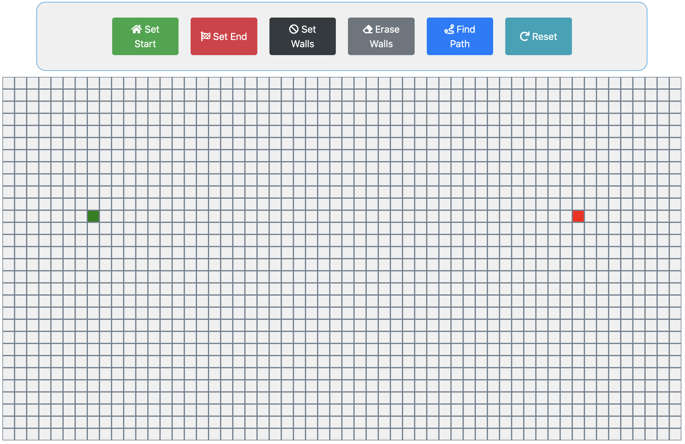

# Pathfinding Algorithm Visualizer
This is the first iteration of my pathfinding visualiser. The program uses 'Djikstra's Algorithm' to find the shortest path between your start and end nodes. I intend to add more algorithms to the program over time.

## Table of Contents
* [General Information](#General-Information)
* [Requirements](#requirements)
* [Installation](#installation)
* [Tutorial](#tutorial)
* [Status](#status)

## General Information
Visualizer for pathfinding algorithms created with 
- Bootstrap 4
- JavaScript

## Requirements
This is a web based app, so you need a web browser to run it

## Installation
- Download the .zip archive from this [github page](https://github.com/SteHeRa/pathfinder)
- Unarchive it
- Open file "index.html"

## Tutorial
### Step 1. Set Start and End Points

Press the "Set start" button and then click on grid where you want to place the start node.
Do the same with the "Set end" button to set the end node.
### Step 2. Place Walls
You can place walls over nodes so algorithm would have to find a way around it.

Press the "Set Walls" button and then click and your cursor to place walls. If you want to remove walls button "Erase Walls" is here to help you. Erasing also works by cicking and dragging.

### Step 3. Find Path

When all the walls are placed and both start and end points are set press the "Find Path" button to run the algorithm and find the shortest path. When you are done, press the "Reset" button to clear the grid and start over.

## Status
More pathfinding algorithms are on their way!